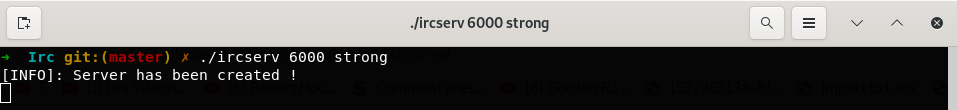

<h1>Ft_irc</h1>
Ft_irc is an IRC (Internet Relay Chat) server coded in C++ and C, allowing the exchange of messages between users.
<h2>Launch the server locally.</h2>
<h4>At the root of the project:</h4>
<pre>make</pre>
<h4>Then launch the executable:</h4>
<b>[INFO]</b> The port should be between 1024 and 65535.
<pre>./ircserv [port] [password] </pre>
<h4>Here, the server is launched on your machine! 🎉<h4>

<h2>Connect using nc</h2>
For <b>simplicity</b> reasons, we recommend using <b>nc</b> to connect. 
Alternatively, you can use the client of your choice.
<h4>In a new terminal:</h4>
<pre>nc localhost 6000</pre>
 
<h2> Commands </h2>
To execute a command, add the <b>/cmd</b> prefix followed by the desired command.
<h4>To connect:</h4>
<pre>
<b>PASS</b> [password] <= Enter the server password.
<b>USER</b> [username] <= Set your username as [username].
</pre>
 <h4>Common commands:</h4>
<pre>
<b>MSG</b> [username] <= Send a private message to the user.
<b>NICK</b> [nickname] <= Set your nickname as username ([nickname]).
</pre>
 <h4>Channels:</h4>
<pre>
<b>JOIN</b> #[channel] <= Join a channel, if you're the first, you'll be an ADMIN.
<b>INVITE</b> [username] <= Invite a user to a channel.
<b>KICK</b> #[channel] [username] <= Kick a person from the channel.
<b>TOPIC</b> #[channel] [topic] <= Change the topic of the channel.
<b>#</b>[channel] [message] <= Send a message to the [channel].
</pre>
 <h4>MODE:</h4>
 <h5>Usage</h5>
 <pre> MODE [flag] [channel] [user] </pre>
 <h5>Flags:</h5>
<pre>
-/+<b>o</b> => Remove or add user rights.
-/+<b>i</b> => Remove or add invitation mode.
-/+<b>t</b> => Remove or add permission to use the <b>topic</b> command for users.
-/+<b>l</b> => Remove or add channel user limit.
-/+<b>k</b> => Remove or add password to join the channel.
</pre>
